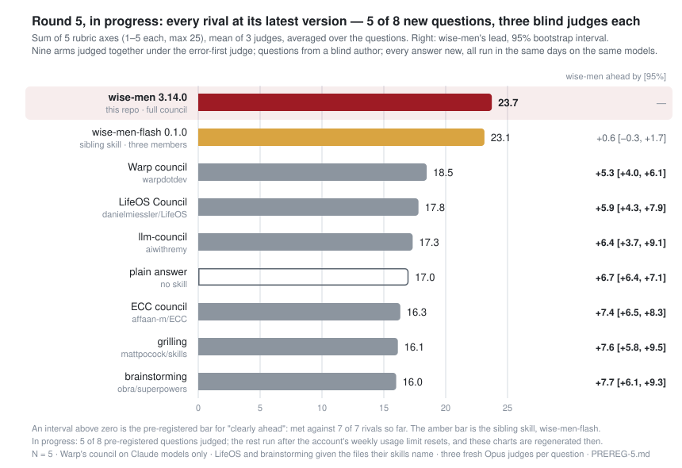
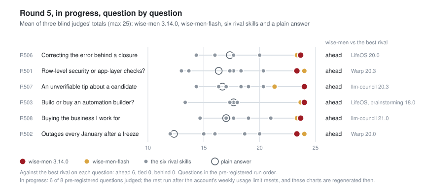
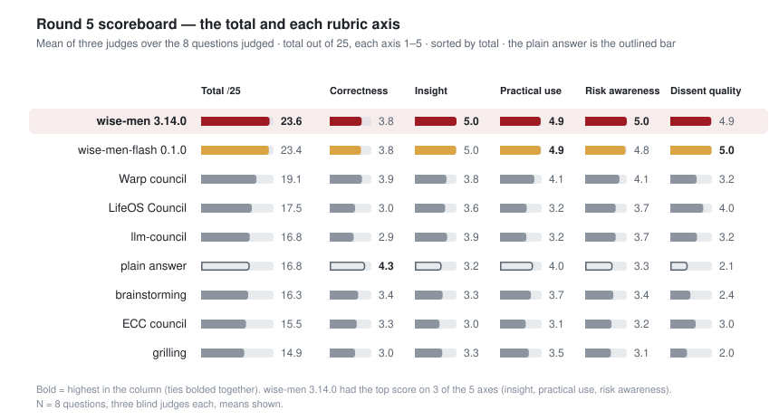
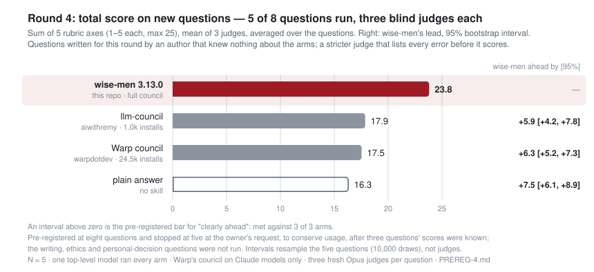
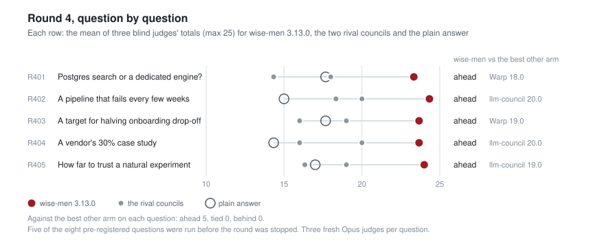
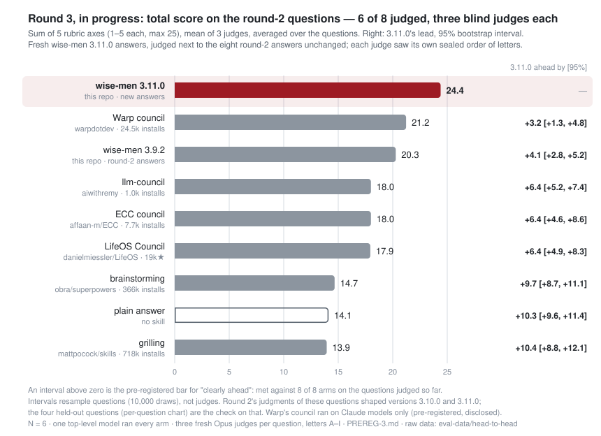
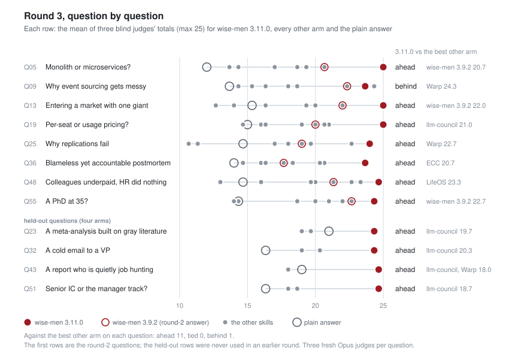
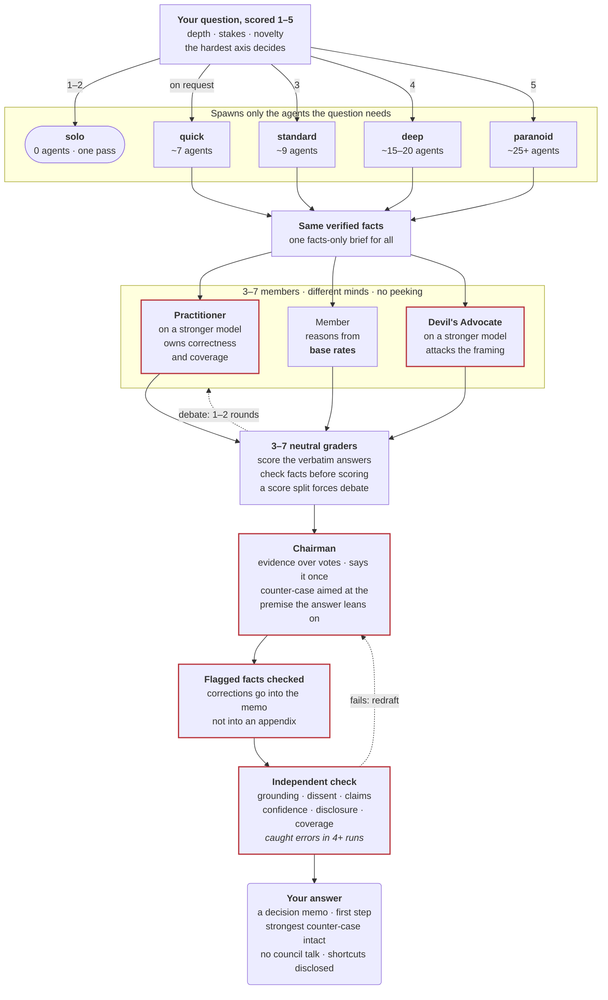

<p align="center"></p>

[](https://github.com/Ali-expandings/wise-men/stargazers) [](LICENSE) [](https://github.com/Ali-expandings/wise-men/actions/workflows/check.yml) [](#install)

Most prompt patterns ask you to take their word for it. This one ships with the blind evals that tested it — raw answers, judgments, and the scripts that reproduce every number.

<p align="center">
  <strong>Beats every rival in a pre-registered blind head-to-head: 24.4/25 against Warp's council at 20.3, llm-council 18.8 and a plain answer 15.5 over 12 questions, with three blind judges each · top score on 11 of 12 · on new questions under a stricter judge (round 4, five of eight run): 23.8 against llm-council 17.9, Warp's council 17.5 and a plain answer 16.3 · beat a structured prompt on 28 of 29</strong><br>
  <sub>Two evals, 5-axis rubric; each head-to-head round was pre-registered before its new arms ran. Round 3 is the last complete round: eight questions re-judged next to the previous version's answers, plus four held-out questions no earlier round used. Round 4 added new questions, an error-first judge and measured time and cost; it was stopped at five of its eight questions. Round 5 — every rival at its latest version, plus the sibling skill wise-men-flash — is in progress: 6 of 8 questions judged so far, wise-men ahead of all seven rivals on each. <a href="#does-it-actually-work">Charts, method and caveats</a>.</sub>
</p>

```
/plugin marketplace add Ali-expandings/wise-men
/plugin install wise-men@wise-men
```

Then: *"run a council on whether we should rewrite the billing service or strangle it incrementally"*.

---

## Does it actually work?

Two blind evals, both shipped raw in this repo. The first puts wise-men next to skills people already use. The second asks the question every prompt-skill eventually gets: does it beat just asking well?

### 1. Against the skills people already use (pre-registered, five rounds)

Eight hard questions — engineering, product, research, writing, ethics, a personal decision — plus, in round 3, four held-out ones. Up to nine ways to answer each: wise-men, six of the most-used and best-known skills for stress-testing a decision ([picked by installs and stars](eval-data/head-to-head/COMPETITOR-SCAN.md)), and a plain answer with no skill. The same top-level model ran every arm with its skill file verbatim; council members ran on whichever Claude models each skill chose. Blind judges scored the answers under letters, in orders sealed in advance. Round 1 had six arms and one judge per question; round 2 added the two most-installed general-purpose council skills, Warp's and ECC's, and re-judged every answer; round 3 re-judged everything with three judges per question next to fresh answers from the current version, and added the held-out questions.

**Round 5 — in progress, 6 of 8 questions judged** (pre-registered in [`PREREG-5.md`](eval-data/head-to-head/PREREG-5.md) before its questions were written). wise-men 3.14.0 and its sibling skill [wise-men-flash](https://github.com/Ali-expandings/wise-men-flash) against every rival from rounds 1–4 — Warp's council, llm-council, LifeOS Council, ECC's council, superpowers brainstorming and mattpocock grilling, each at its latest version — plus a plain answer. Eight new questions from a blind author, one of each kind, with the writing, ethics and personal questions round 4 never reached run early; every answer new; three blind Opus judges per question under round 4's error-first judge. The remaining questions are being run in the pre-registered order, and the table and charts below are regenerated as each one is judged.

<p align="center"><picture><source media="(prefers-color-scheme: dark)" srcset="assets/h2h-v5-dark.svg"></picture></p>

| round 5 (6 of 8 questions) | total /25 | correct | insight | practical | risk | dissent |
|---|--:|--:|--:|--:|--:|--:|
| **wise-men 3.14.0** | 23.7 | 3.9 | 5.0 | 4.8 | 5.0 | 4.9 |
| wise-men-flash 0.1.0 | 23.3 | 3.8 | 4.9 | 4.8 | 4.8 | 4.9 |
| Warp council | 18.7 | 3.8 | 3.7 | 4.1 | 4.1 | 3.0 |
| LifeOS Council | 17.9 | 3.1 | 3.8 | 3.2 | 3.7 | 4.2 |
| llm-council | 16.9 | 2.9 | 3.9 | 3.2 | 3.7 | 3.3 |
| ECC council | 16.3 | 3.4 | 3.2 | 3.2 | 3.2 | 3.2 |
| plain answer | 16.2 | 4.0 | 3.1 | 3.9 | 3.2 | 2.0 |
| superpowers brainstorming | 16.0 | 3.3 | 3.2 | 3.7 | 3.4 | 2.4 |
| mattpocock grilling | 15.4 | 3.3 | 3.4 | 3.6 | 3.1 | 2.1 |

- wise-men 3.14.0 against wise-men-flash 0.1.0: +0.4 [−0.3, +1.3], W–T–L 4–0–2 — ahead.
- wise-men 3.14.0 against Warp council: +4.9 [+3.9, +5.9], W–T–L 6–0–0 — clearly ahead.
- wise-men 3.14.0 against llm-council: +6.7 [+4.4, +9.0], W–T–L 6–0–0 — clearly ahead.
- wise-men 3.14.0 against LifeOS Council: +5.7 [+4.5, +7.4], W–T–L 6–0–0 — clearly ahead.
- wise-men 3.14.0 against ECC council: +7.4 [+6.7, +8.1], W–T–L 6–0–0 — clearly ahead.
- wise-men 3.14.0 against superpowers brainstorming: +7.7 [+6.4, +9.1], W–T–L 6–0–0 — clearly ahead.
- wise-men 3.14.0 against mattpocock grilling: +8.2 [+6.4, +10.1], W–T–L 6–0–0 — clearly ahead.
- wise-men 3.14.0 against plain answer: +7.4 [+6.5, +8.9], W–T–L 6–0–0 — clearly ahead.
- wise-men 3.14.0: beats every rival — clearly ahead of all seven.

- Axes, wise-men 3.14.0: the highest insight and risk awareness of the nine arms, tied for the highest practical use and dissent quality; above every rival on 4 of 5 axes.

Judge agreement: mean SD of the three judges' totals 0.67.

<p align="center"><picture><source media="(prefers-color-scheme: dark)" srcset="assets/h2h-v5-questions-dark.svg"></picture></p>

<p align="center"><picture><source media="(prefers-color-scheme: dark)" srcset="assets/h2h-v5-axes-dark.svg"></picture></p>

So far wise-men 3.14.0 is ahead of all seven rivals on every question judged, and wise-men-flash is ahead of all seven rivals on every question judged. Correctness is its weakest showing: the plain answer (4.0) scores higher than wise-men 3.14.0 (3.9). With this few questions the intervals are wide; the pre-registered claims apply to the finished round. Per-question scores, run times, costs and every disclosure so far: [`RESULTS-V5.md`](eval-data/head-to-head/RESULTS-V5.md).

**Round 4** (pre-registered in [`PREREG-4.md`](eval-data/head-to-head/PREREG-4.md) before any run; stopped at five of eight questions). New questions written by an author that knew nothing about the arms, and a stricter judge prompt that lists every error before it scores. Rivals: Warp's council, llm-council, a plain answer.

<p align="center"><picture><source media="(prefers-color-scheme: dark)" srcset="assets/h2h-v4-dark.svg"></picture></p>

| round 4 (5 of 8 questions) | total /25 | correct | insight | practical | risk | dissent |
|---|--:|--:|--:|--:|--:|--:|
| wise-men 3.13.0 (default) | 23.8 | 4.0 | 5.0 | 4.9 | 4.9 | 5.0 |
| llm-council | 17.9 | 3.1 | 3.9 | 3.3 | 3.8 | 3.7 |
| Warp council | 17.5 | 3.4 | 3.5 | 4.0 | 3.7 | 3.0 |
| plain answer | 16.3 | 3.9 | 3.5 | 4.2 | 2.9 | 1.8 |

- wise-men 3.13.0 (default) against Warp council: +6.3 [+5.2, +7.3], W–T–L 5–0–0 — clearly ahead.
- wise-men 3.13.0 (default) against llm-council: +5.9 [+4.2, +7.8], W–T–L 5–0–0 — clearly ahead.
- wise-men 3.13.0 (default) against plain answer: +7.5 [+6.1, +8.9], W–T–L 5–0–0 — clearly ahead.

- wise-men 3.13.0 (default): highest mean on 5 of 5 axes.

Judge agreement: mean SD of the three judges' totals 0.59.

<p align="center"><picture><source media="(prefers-color-scheme: dark)" srcset="assets/h2h-v4-questions-dark.svg"></picture></p>

<p align="center"><picture><source media="(prefers-color-scheme: dark)" srcset="assets/h2h-v4-axes-dark.svg"></picture></p>

What it shows: wise-men finished ahead of every rival on every one of the five questions, by 5.9 to 7.5 points of 25, with the top score on all five axes, and every interval excludes zero — a wider lead than round 3's, on questions it had never seen, under a judge built to find errors.

The round was pre-registered at eight questions and stopped at five at the owner's request, after the scores of the first three were known; the writing, ethics and personal-decision questions were not run. Per-question scores, run times and costs, a fifth experimental arm that is no longer part of this skill, and every deviation: [`RESULTS-V4.md`](eval-data/head-to-head/RESULTS-V4.md).

**Round 3** (pre-registered in [`PREREG-3.md`](eval-data/head-to-head/PREREG-3.md) before any run; the last complete round). Versions 3.10.0 and 3.11.0 were built from round 2's judgments, so round 3 measures them two ways. Part A: fresh wise-men 3.11.0 answers to the same eight questions, judged next to round 2's eight answers unchanged, by three blind judges per question, each with its own sealed order. Part B: four held-out questions no earlier round used (research, writing, ethics, a personal decision), answered by wise-men 3.11.0, Warp's council, llm-council and a plain answer.

<p align="center"><picture><source media="(prefers-color-scheme: dark)" srcset="assets/h2h-v3-dark.svg"></picture></p>

| round 3, Part A (8 of 8 questions) | total /25 | correct | insight | practical | risk | dissent | wise-men 3.11.0 ahead by [95%] | W–T–L |
|---|--:|--:|--:|--:|--:|--:|--:|--:|
| **wise-men 3.11.0** | 24.4 | 4.8 | 5.0 | 4.8 | 5.0 | 4.9 | — | — |
| Warp council | 21.3 | 4.6 | 4.3 | 4.6 | 4.5 | 3.3 | +3.2 [+1.8, +4.5] | 7–0–1 |
| wise-men 3.9.2 | 20.7 | 3.9 | 4.4 | 3.8 | 4.2 | 4.4 | +3.7 [+2.6, +4.8] | 8–0–0 |
| LifeOS Council | 19.1 | 3.5 | 4.2 | 3.7 | 3.7 | 4.0 | +5.3 [+3.5, +7.3] | 8–0–0 |
| llm-council | 18.6 | 3.6 | 4.0 | 3.6 | 3.8 | 3.6 | +5.8 [+4.7, +6.8] | 8–0–0 |
| ECC council | 18.3 | 3.9 | 3.9 | 3.6 | 3.6 | 3.3 | +6.1 [+4.8, +7.8] | 8–0–0 |
| brainstorming | 14.8 | 3.8 | 3.1 | 3.8 | 2.6 | 1.5 | +9.6 [+8.8, +10.7] | 8–0–0 |
| plain answer | 14.2 | 4.0 | 2.9 | 3.5 | 2.4 | 1.4 | +10.2 [+9.7, +11.0] | 8–0–0 |
| grilling | 13.8 | 3.5 | 2.9 | 3.3 | 2.6 | 1.7 | +10.6 [+9.3, +11.8] | 8–0–0 |

| round 3, Part B (held-out, 4 of 4 questions) | total /25 | correct | insight | practical | risk | dissent | wise-men 3.11.0 ahead by [95%] | W–T–L |
|---|--:|--:|--:|--:|--:|--:|--:|--:|
| **wise-men 3.11.0** | 24.5 | 5.0 | 5.0 | 4.6 | 5.0 | 4.9 | — | — |
| llm-council | 19.2 | 3.8 | 4.3 | 3.3 | 3.7 | 4.3 | +5.3 [+4.3, +6.3] | 4–0–0 |
| Warp council | 18.5 | 4.3 | 3.7 | 3.8 | 4.0 | 2.7 | +6.0 [+5.3, +6.7] | 4–0–0 |
| plain answer | 18.2 | 4.8 | 4.2 | 4.5 | 2.8 | 2.0 | +6.3 [+4.5, +8.2] | 4–0–0 |

Ahead by = mean per-question gap in total score, with a 95% bootstrap interval over questions (10,000 resamples, seed 20260918); W–T–L = questions won, tied and lost on the mean of the three judges.

Over all 12 questions the four arms share, wise-men 3.11.0 is ahead of Warp council by +4.1 [+2.8, +5.2], llm-council by +5.6 [+4.8, +6.4], plain answer by +8.9 [+7.5, +10.1].

**What it shows.** Under the wording rules fixed in the pre-registration, wise-men 3.11.0 **beats every rival**: against each of the eight other arms the interval excludes zero on the widest question set the two share. It had the top score on 11 of the 12 questions (Warp's council took Q09, 24.3 to 23.7) and the highest mean on every axis, including correctness and practical use, the two axes Warp's council led in round 2. Against its own previous version, 3.9.2, on the same eight questions and the same judges, it gained 3.7 points, which is the measured effect of the 3.10.0 and 3.11.0 changes. Part B is the check that the gain is not a fit to round 2's judgments: on the four questions no earlier round used, 24.5 against Warp's council 18.5, llm-council 19.2 and the plain answer 18.2. The three judges agreed closely (mean SD of their totals 0.63 points). Per-question scores, cost and every disclosure, including five wise-men runs the account's usage limit interrupted and that resumed from their own transcripts, one whose orchestrator paused for approval and was told to continue, and one Warp run written in the compressed register the author's global config asks of every agent: [`RESULTS-V3.md`](eval-data/head-to-head/RESULTS-V3.md).

<p align="center"><picture><source media="(prefers-color-scheme: dark)" srcset="assets/h2h-v3-questions-dark.svg"></picture></p>

**Round 2** (the completed round; eight arms, one judge per question):

<p align="center"><picture><source media="(prefers-color-scheme: dark)" srcset="assets/h2h-v2-dark.svg"></picture></p>

| round 2 | total /25 (vs plain) | correct | insight | practical | risk | dissent | beat plain |
|---|--:|--:|--:|--:|--:|--:|--:|
| [Warp council](https://github.com/warpdotdev/common-skills) 24.5k installs | **23.4** (+8.1) | **4.9** | **4.8** | **4.9** | **4.9** | 4.0 | **8 of 8** |
| **wise-men** | 21.1 (+5.9) | 3.8 | 4.6 | 3.6 | 4.5 | **4.6** | **8 of 8** |
| [llm-council](https://github.com/aiwithremy/claude-skills-llm-council) 1.0k installs | 19.4 (+4.1) | 3.6 | 4.1 | 3.8 | 4.3 | 3.6 | **8 of 8** |
| [LifeOS Council](https://github.com/danielmiessler/LifeOS) 19k★ | 19.1 (+3.9) | 3.4 | 4.1 | 3.8 | 3.8 | 4.1 | 7 of 8 |
| [ECC council](https://github.com/affaan-m/ECC) 7.7k installs | 19.1 (+3.9) | 4.0 | 3.9 | 3.8 | 3.9 | 3.6 | 7 of 8 |
| [superpowers](https://github.com/obra/superpowers) brainstorming 366k installs | 15.9 (+0.6) | 3.9 | 3.3 | 3.9 | 2.9 | 2.0 | 5 of 8 |
| plain answer | 15.3 | 4.3 | 3.0 | 3.5 | 2.6 | 1.9 | — |
| [mattpocock](https://github.com/mattpocock/skills) grilling 718k installs | 13.8 (−1.5) | 3.4 | 2.9 | 3.3 | 2.8 | 1.5 | 2 of 8 |

Bold = best in the column (ties bolded together). Installs from the skills.sh registry; LifeOS Council ships inside a larger repo, so its stars are shown instead.

**What it shows.** Warp's council scored highest — 23.4, the top score (alone or shared) on 7 of 8 questions, and the lead on every axis except dissent. wise-men came second: ahead of llm-council, LifeOS Council and ECC's council, with the best dissent score of all eight, and it beat the plain answer on every question. The judgments show where it lost the points: in 6 of 8 the judge marked down process talk inside wise-men's answer (council meta, reviewer scores), its practical use was the lowest of the five councils, and its correctness sat below the plain answer's. All eight of Warp's answers share the same four core sections: recommendation, why, tradeoffs and risks, final call. Warp ran adapted: its skill asks for a model-diverse council (Opus-, GPT- and open-source-class members), and here every member was a Claude model, so its intended setup could score differently. brainstorming and grilling are built to interview you before deciding; with nobody to answer they had to assume, so this measures them on a job they were not designed for.

**Round 1** (six arms, before Warp and ECC were added): wise-men had the highest mean, 23.3, and scored 5/5 on risk and dissent on all eight questions. Round 2 re-judged those six answers unchanged; the judge gave each of them a lower mean, by 1.1 to 2.5 points, but kept their order apart from LifeOS Council and llm-council swapping places — so compare scores within a round, not across rounds.

<p align="center"><picture><source media="(prefers-color-scheme: dark)" srcset="assets/h2h-v2-axes-dark.svg"></picture></p>

<details>
<summary>Every question, round 1, the cost, and how the study was run</summary>

<p align="center"><picture><source media="(prefers-color-scheme: dark)" srcset="assets/h2h-v2-questions-dark.svg"></picture></p>

- **Pre-registered.** [`PREREG.md`](eval-data/head-to-head/PREREG.md) (round 1, seed 20260916) was committed before any arm ran; [`PREREG-2.md`](eval-data/head-to-head/PREREG-2.md) (round 2, seed 20260917) before its two new arms ran and before any re-judging. [`PREREG-3.md`](eval-data/head-to-head/PREREG-3.md) (round 3, seed 20260918) before any round-3 run: it fixed the held-out questions by a stated rule, three judges per question with their own sealed orders, and the bootstrap analysis and wording rules used above. They fix the arms and their commits, the questions, the judge prompt, the sealed blinding order and the analysis; rounds 1 and 2 had no significance test at N=8. The judge scores the same five axes on the same 1–5 scale as the N=29 eval below, but its prompt differs: it ranks all the answers first instead of comparing pairs, and it has no per-score anchors. The [competitor scan](eval-data/head-to-head/COMPETITOR-SCAN.md) that picked round 2's arms was committed with PREREG-2.
- **Parity.** Every arm ran in a fresh top-level subagent on the same model (Sonnet), with its skill file and the question verbatim; skills that spawn subagents did so, on the Claude models they chose. Pre-registered adaptations: brainstorming, grilling and ECC's council stated the answers they assumed instead of waiting for a human; Warp's council ran its members as Claude Code subagents on Claude models, with no pause for approval.
- **Normalization.** Headers and orchestrator status lines were stripped from every arm. wise-men's appended audit trail was stripped on 4 questions, because the skill shows it only on request; LifeOS Council's round-by-round debate was kept, because its output format makes the transcript the answer; Warp's member list stayed where it was a headed section and was cut on 2 questions where it sat as a short paragraph before the first heading, so the judge saw it on 6 of 8; and the header rule also removed a one-line title from 2 brainstorming answers. Normalization only removed text; apart from disclosed redactions of personal details, no answer was edited.
- **Deviations.** Round 1 ([`RESULTS.md`](eval-data/head-to-head/RESULTS.md)): one amendment after Q13 exposed that arms could read the author's files (from then on an arm reads only its own skill files), and five re-runs — two at Q13 (one arm had read private notes, one orchestrator returned early) and three at Q55 (killed by a rate limit before producing any output). Round 2 ([`RESULTS-V2.md`](eval-data/head-to-head/RESULTS-V2.md)): no re-runs, one parser fix for the extra answer labels, and one first name redacted before blinding. Round 3 ([`RESULTS-V3.md`](eval-data/head-to-head/RESULTS-V3.md)): no re-runs; five wise-men runs were stopped mid-run by the account's usage limit and resumed from their own transcripts after the reset, one wise-men orchestrator paused for approval before its synthesis check and was told to continue, and one Warp run was written in the compressed register the author's global config asks of every agent (a condition every arm shared in every round); all kept as produced.
- **Cost.** Round 2, median minutes per question: Warp's council 12.0, wise-men 8.2, ECC's council 5.1, llm-council 3.9, LifeOS Council 3.5, about a minute for brainstorming and grilling, and 15 seconds for a plain answer; wise-men chose deep tier on 4 of the 8 questions. Round 3, uninterrupted runs: wise-men 3.11.0 26.8, llm-council 15.1, Warp's council 8.2, plain answer 1.4 — the current version is the slowest arm by a wide margin.
- **Limits.** N=8 per round (12 in round 3, three judges each), one judge model, and every answer and judgment comes from the same model family; a distinctive answer shape can be recognizable even under letters. Round 3's Part A questions and round 2's judgments of them were the evidence the current version was built on, so only Part B is a clean test, and it has four questions. Installs from the skills.sh registry and stars from the GitHub API, 2026-09-17; star counts are for whole repos.

<details>
<summary>Round 1: charts and table (six arms)</summary>

<p align="center"><picture><source media="(prefers-color-scheme: dark)" srcset="assets/h2h-dark.svg"></picture></p>

| vs plain answer | total /25 | correct | insight | practical | risk | dissent | beat plain |
|---|--:|--:|--:|--:|--:|--:|--:|
| **wise-men** | **23.3** (+6.9) | **4.6** | **4.6** | 4.0 | **5.0** | **5.0** | **8 of 8** |
| [LifeOS Council](https://github.com/danielmiessler/LifeOS) 19k★ | 21.4 (+5.0) | 4.4 | 4.3 | 4.1 | 4.3 | 4.4 | **8 of 8** |
| [llm-council](https://github.com/aiwithremy/claude-skills-llm-council) 2.1k★ | 20.8 (+4.4) | 3.9 | 4.5 | 4.0 | 4.4 | 4.0 | **8 of 8** |
| [superpowers](https://github.com/obra/superpowers) brainstorming 288k★ | 17.9 (+1.5) | **4.6** | 3.8 | **4.4** | 3.3 | 1.9 | 4 of 8 |
| [mattpocock](https://github.com/mattpocock/skills) grilling 264k★ | 16.3 (−0.1) | 3.9 | 3.3 | 4.0 | 3.3 | 1.9 | 3 of 8 |
| plain answer | 16.4 | **4.6** | 3.3 | 4.0 | 2.9 | 1.6 | — |

Bold = best in the column (ties bolded together). Stars are for the whole repo.

<p align="center"><picture><source media="(prefers-color-scheme: dark)" srcset="assets/h2h-axes-dark.svg"></picture></p>

<p align="center"><picture><source media="(prefers-color-scheme: dark)" srcset="assets/h2h-questions-dark.svg"></picture></p>

</details>

Raw answers, blinded packets, judgments and parsed scores: [`eval-data/head-to-head/`](eval-data/head-to-head/). Reproduce the tables: `python3 eval-data/head-to-head/h2h3.py readme` (round 3; `results` rewrites `RESULTS-V3.md`), `H2H_STUDY=v2 python3 eval-data/head-to-head/h2h.py readme` (round 2) and `python3 eval-data/head-to-head/h2h.py readme` (round 1); `report` prints the two-decimal means and win–tie–loss counts behind them.
</details>

### 2. Against a structured single prompt (N=29)

<p align="center"><picture><source media="(prefers-color-scheme: dark)" srcset="assets/headline-dark.svg"></picture></p>

**Short version: the core loop is measured; the refinements on top are field-used, not measured.** The numbers above come from the **v2.3-era core loop** — a council with no context brief, no reasoning-procedure assignment, no validators, no synthesis-checker, and with the Devil's-Advocate model upgrade deliberately switched off so every member ran the same model. Everything this repo adds on top of that is *reasoned from* the result, not measured by it. (The head-to-head above did run the shipped v3.9.2 protocol end to end, but against other skills and a plain answer, not against this structured prompt. Versions 3.10.0 and 3.11.0 then changed how the answer is written and how peer scores are used, and added a practitioner seat on the strong model, coverage checks and a synthesis check at every council tier, on the evidence of those judgments and a recorded council run; head-to-head round 3, pre-registered in `eval-data/head-to-head/PREREG-3.md` before any run, measured those changes: +3.7 points over 3.9.2 on the same questions and judges, and first on four held-out questions, see above. Version 3.12.0 then changed how flagged claims are checked, how the counter-position is chosen, when a claim is tagged unverified and what the memo may repeat, from that round's judgments and a recorded council run; those changes are not measured.) The measured configuration is weaker than what ships, so the shipped default should be at least as good — but treat that as an expectation, not a finding. The judge was a single blinded Claude model grading Claude outputs, which is exactly the bias described in one of the papers credited at the bottom of this file.

With that stated plainly, the table behind the chart — 30-question blind evaluation, 3 arms per question, 5-axis rubric (max 25):


| Arm | Mean | Median |
|---|---|---|
| **C — full council** | **24.5** | 25 |
| B — one structured prompt (5 perspectives + dissent, single call) | 20.8 | 21 |
| A — direct answer | 16.3 | 16 |

- The council beat the structured single prompt on **28 of 29** persisted questions.
- Wilcoxon signed-rank: **p = 6.3 × 10⁻⁶** (council > structured prompt), **p = 1.3 × 10⁻⁶** (council > direct).
- No rubric axis was significantly worse; four of five were significantly better.
- It won **13/13** questions labeled single-prompt-shaped (written to favour one structured prompt).

<details>
<summary>Every question, and where the gap comes from</summary>

<p align="center"><picture><source media="(prefers-color-scheme: dark)" srcset="assets/questions-dark.svg"></picture></p>

<p align="center"><picture><source media="(prefers-color-scheme: dark)" srcset="assets/axes-dark.svg"></picture></p>

Charts regenerate from `eval-data/parsed/` with `python3 scripts/make_charts.py`.
</details>

**Read the caveats too** — they're in `eval-data/HISTORY.md` and they're real: one blind judge, Claude judging Claude, N=29 with the 30th question outstanding, a p-value computed one question short of the pre-registered stopping rule (`HISTORY.md` literally says "do not declare a verdict before then"), the measured-vs-shipped gap described above, a treatment change to Arm B mid-eval (an anti-spawn wrapper), a reviewer-prompt fix that was reversed mid-eval, two early judgments salvaged from chat context rather than captured from disk, one question (Q23) resolved by a third blind judge, and two questions (Q09/Q11) whose Chairman model was never recorded — dropping them leaves the result unchanged (N=27, 26/27, p=1.4e-05; `eval-data/analysis/RESULTS_N29.md`).

**Reproducing the numbers.** Requires Python 3 and PyYAML (`pip install pyyaml`), then:

```bash
python3 eval-data/analysis/wilcoxon_n29.py
```

It prints `Loaded 29 questions`, means C=24.48 / B=20.76 / A=16.28, and `C > B ... p=6.30e-06` (last verified 2026-09-16 on the packaged script). **If it doesn't, that's a bug — please open an issue.** The exact v2.3 protocol the eval measured ships verbatim in `eval-data/protocol-v2.3-frozen/`.

The other honest finding: **a single structured prompt (Arm B, 20.8) captures most of the gain for none of the cost.** That's shipped here as `solo` tier and it's the default for easy questions. Spend the full council when the decision is worth ~10 subagent calls.

---

## Field use (Jul–Sep 2026)

Versions 3.0–3.7 of this protocol ran ~35 real councils across ~15 projects — code cutovers, business plans, hiring, brand, security, one go-live audit at paranoid tier. That is use, not measurement, and it validates the *problems* the v3.8 rules fix, not the rules themselves: those were written from the transcripts afterwards, and their first live run was the skill reviewing its own release (2026-09-16, deep tier, record in `CHANGELOG.md`). The synthesis checker (Stage 4.5) rejected the Chairman's first draft in at least four runs for real errors (fabricated attributions, a pre-debate quote presented as post-debate, undisclosed shortcuts). What broke in the field became v3.8: a reviewer floor instead of a rule every run violated, a verbatim grading packet, an anti-anchoring rule for the orchestrator, a post-council verification step, defined round-2 pairing, and a persisted council record. Details in `SKILL.md` → "Field record".

## Install

**Plugin (recommended — one step, the member agent registers itself):**

```
/plugin marketplace add Ali-expandings/wise-men
/plugin install wise-men@wise-men
```

**Or clone into your skills folder:**

```bash
git clone https://github.com/Ali-expandings/wise-men.git ~/.claude/skills/wise-men
mkdir -p ~/.claude/agents && cp ~/.claude/skills/wise-men/agents/wise-member.md ~/.claude/agents/
```

The second line matters for the clone path: `wise-member` is a **tool-restricted agent** (read-only, no ability to spawn agents or run commands) used for every council member. It makes runaway recursion structurally impossible instead of merely asking the model not to. The plugin install registers it automatically (as `wise-men:wise-member`); the clone install needs the copy. Without it the skill still runs — just on a politer guarantee.

Requires [Claude Code](https://claude.com/claude-code). No API keys, no external services, no Python (except to re-run the eval stats). Restart Claude Code, then:

```
/wise-men:wise-men should we rewrite the billing service or strangle it incrementally?
```

(`/wise-men` with the clone install; plain language — "run a council on…", "red team this" — works with both.)

## Usage

```
/wise-men <question>              # auto-picks effort from the question's stakes
/wise-men deep <question>         # 5-7 members + a debate round when they split
/wise-men paranoid <question>     # 7 members, two debate rounds — irreversible calls
/wise-men <question> --solo       # zero subagents, one structured pass
```

Flags: `--full` (whole audit trail), `--brief`, `--debate`, `--model=…`, `--cheap`, `--strong`.

It also answers to plain language — "run a council on this", "red team this plan", "stress-test this idea".

**Don't** use it for lookups, one-liners, or decisions you've already made. It says so itself and will hand you a direct answer instead.

## How it works



Easy questions skip the council (`solo` tier). Every council tier runs the independent check; quick and standard skip the debate, and deep and paranoid debate when the rule fires. `--debate` forces a debate at any tier.

**Each technique exists to block a specific failure:**

| Technique | Failure it prevents |
|---|---|
| Agents spawned to match the question — 0 for an easy one, ~25+ for an irreversible call — sized by the hardest of depth, stakes and novelty | a quick answer where a council was needed, or a council's worth of agents spent on a lookup |
| One verified, facts-only brief, identical for every member | members arguing from different — or invented — facts |
| A different reasoning method per member: first principles, base rates, precedent, incentives, falsification | five answers that agree for the same wrong reason |
| Members run as read-only agents and never see each other | groupthink, runaway subagents, a member editing your files |
| A Devil's Advocate on a stronger model, told to attack the framing | a token contrarian too weak to change the outcome |
| A practitioner seat on a stronger model — named for the job the question belongs to — that owns correctness and covering every part of the question | answers that skip part of what was asked or the steps a professional would take (5 of 8 head-to-head answers lost points this way) |
| Fresh graders score the verbatim answers and check facts first | a confident error, or the orchestrator's paraphrase, winning the scores |
| A debate triggered by a fixed rule over scores and positions | skipping the argument because consensus *feels* settled |
| Dissent kept word for word and aimed at the premise the recommendation leans on; a blind spot several members share caps the confidence | watered-down dissent, a well-argued side-issue standing in for the real objection (three round-3 judges docked that), and false consensus |
| The answer is a decision memo — recommendation, why, what to do, risks, the strongest counter-position — and peer scores never count as evidence in it | council talk burying the answer, and unverified claims dressed as checked because reviewers liked them (both cost points in the head-to-head) |
| Claims the members flagged are checked before the answer ships, and a correction rewrites the sentence instead of sitting in an appendix | the reader acting on the overstated version while the fix hides below the memo (round 3) |
| An independent check of the corrected draft, including every load-bearing number, date and precedent, anything said twice, and sections that don't fit the question | fabricated attributions, unsupported specifics and undisclosed shortcuts — it rejected first drafts in 4+ real runs |

<details>
<summary>Stage by stage</summary>

```
Pre-flight → difficulty (depth / stakes / novelty, max-dominates) → tier
  Stage 0    pick personas by domain; Devil's Advocate is mandatory
             each member gets a distinct REASONING PROCEDURE
             (precedent · first principles · base rates · incentives · falsification)
  Stage 0.5  one shared, facts-only context brief — members are otherwise blind
  Stage 1    N members answer in parallel, fixed 5-section contract  → validator
  Stage 2    N fresh neutral graders score everyone on a 4-axis rubric → validator
  Stage 3    debate round if the council genuinely splits
  Stage 4    Chairman writes a decision memo — evidence over votes, dissent verbatim
  Stage 4.5  an independent checker audits the synthesis before you see it
```

</details>

Two design choices carry most of the weight:

**Diversity comes from reasoning procedures, not job titles.** Ensembles help when errors *decorrelate*. Five personas that all pattern-match the same way just agree with themselves five times, so each member is assigned a different way of reasoning about the problem.

**Dissent is structurally protected.** It's preserved verbatim, it can't be truncated by any brevity flag, and it must be a clean counter-position — re-stating the majority view with hedges doesn't count. The eval's single council loss was exactly that failure.

## How it compares

Measured against the skills people already use, see [the head-to-head](#1-against-the-skills-people-already-use-pre-registered-three-rounds): round 3: version 3.11.0 first of nine on the eight round-2 questions and first of four on the held-out questions, clearly ahead of every arm under the pre-registered wording; round 2: second of eight, behind Warp's council; round 1: highest of six; the best dissent score in every round.

The question every prompt-skill gets asked — after ponytail's benchmark was matched by a seven-word prompt — is *does the skill beat just asking well?* The N=29 eval was built around that question. Arm B is one structured prompt (five perspectives + a dissent, no subagents); it is also shipped as the `solo` tier.

| vs direct answer (blind, 25-pt rubric, N=29) | score | beat the structured prompt | cost |
|---|---|---|---|
| **wise-men council** (standard tier) | **24.5** | **28 / 29** | 8–9 subagent calls; about 20 minutes in the current protocol (measured, below) |
| structured single prompt (= `solo` tier) | 20.8 | — | one pass, no subagents |
| direct answer | 16.3 | 0 / 29 | one pass |

Against the other council skills for Claude Code (facts from their READMEs or skill files, 2026-09-16/17; full table with sources in [`resources/landscape.md`](resources/landscape.md)):

| | wise-men | [llm-council skill](https://github.com/aiwithremy/claude-skills-llm-council) 2.1k★ | [llm-council-skill](https://github.com/tenfoldmarc/llm-council-skill) 766★ | [council-review](https://github.com/ngmeyer/council-review) | [agent-review-panel](https://github.com/wan-huiyan/agent-review-panel) | [Warp council](https://github.com/warpdotdev/common-skills) 24.5k installs | [ECC council](https://github.com/affaan-m/ECC) 7.7k installs |
|---|---|---|---|---|---| --- | --- |
| Independent members, no keys | yes | yes | yes | yes | yes | yes | yes |
| Peer review | 4-axis rubric, parsed + validated | method unspecified | anonymized | anonymous, confidence | blind final score | — | — |
| Debate | conditional, mechanical trigger | — | inside review | adaptive multi-round | 1–3 rounds | optional second round | another round on request |
| Dissent preserved | verbatim, cannot be truncated | agree/clash | agree/clash | "What You Lose" | with judge rulings | consensus + disagreements | strongest dissent + premise check |
| Independent check of the synthesis | yes | — | — | — | Opus judge | — | — |
| Members structurally unable to spawn/run/write | yes | — | — | — | read-only shell | read-only by instruction | — |
| Cost tiers | 5, with spend ceiling | — | — | 5 modes | budget mode | — | — |
| Evidence in the repo | raw eval + script | none | none | one A/B figure | one cost audit | none | none |

<p align="center"><picture><source media="(prefers-color-scheme: dark)" srcset="assets/landscape-dark.svg"></picture></p>

What they have that this doesn't: multi-vendor councils, convergence-driven long debates, consensus gates, code-specific scanners, HTML reports — listed honestly in the landscape file. The decision-memo answer shape of Warp's council, which outscored wise-men in round 2 of the head-to-head, was adopted in 3.10.0; round 3 of the head-to-head then put 3.11.0 ahead of Warp's council by 4.1 points over 12 questions.

## Cost

Measured, not estimated: in head-to-head round 3 (Sonnet orchestrator, September 2026) a standard council (9–10 subagent calls) took 18–23 minutes and about 190k–230k tokens as the harness reports them, and a deep council (13–20 calls) 31–69 minutes and 240k–295k tokens — against about 8 minutes for Warp's council, 15 for llm-council and 1.4 for a plain answer. The harness does not split input, output and cached tokens, so no dollar figure is given; earlier versions of this file quoted a few cents per council, an estimate built on assumed 700-token prompts that real runs exceed by more than an order of magnitude. Solo tier is one pass in the main thread. Cheap models grade; stronger models argue; the model mapping lives in one table in `resources/model-routing.md` — update it there when models change and nothing else moves.

## Limits (the ones that matter)

- **Single-model.** Every member is Claude, so persona diversity approximates but doesn't achieve architectural diversity. Shared blindspots survive.
- **The Chairman is the orchestrator.** Same thread picks the personas and writes the synthesis. Stage 4.5's external checker mitigates this; it doesn't remove it.
- **The refinements aren't isolated.** The N=29 eval validated the v2.3 core loop against a structured prompt; the head-to-head measured the shipped protocol end to end against six other skills, at N=8. No eval isolates what each refinement adds — which is the same circularity the skill would flag in your reasoning.
- **One judge model, same family.** Both evals use a single blind judge model grading answers from the same model family. The skill's own synthesis checker exists because that kind of judge has known biases.
- **Members are offline.** `wise-member` cannot browse or run anything. Facts go in through the context brief; flagged claims that survive into the draft are checked by the orchestrator before the independent check, and a correction lands in the memo with one footer line.
- **Verbose.** `SKILL.md` is long. A casual invocation reads it, improvises, and mostly gets the protocol right; the numbered runbook at the top exists to keep that honest.

## Repo layout

```
.claude-plugin/           plugin + marketplace manifests
SKILL.md                  the protocol (the only file auto-loaded)
agents/wise-member.md     tool-restricted member agent — auto-registered by the plugin install
resources/                personas · model routing · stage prompt templates · council-record template · landscape (competitors, sourced)
examples/                 two worked end-to-end runs
eval-spec.md              the frozen evaluation design (written before the eval ran)
eval-data/                the N=29 blind eval: questions, raw arms, judgments, stats, frozen v2.3 protocol
eval-data/head-to-head/   the pre-registered head-to-head (three rounds) vs six popular skills: raw answers, blinded packets, judgments, h2h.py, h2h3.py
scripts/check.sh          consistency check — run before every commit (trigger sync, no $-digit, agent copy, PII)
scripts/make_charts.py    regenerates assets/*.svg (light + dark) from both evals' parsed scores
assets/                   banner + README charts (hand-authored SVG, a light and a dark file each)
CHANGELOG.md              condensed version history (detail in eval-data/SESSION_LOG.md)
requirements.txt          PyYAML — only needed to re-run the eval stats
AGENTS.md · CONTRIBUTING.md · SECURITY.md · LICENSE · .gitignore
```

The skill itself has **no runtime dependencies** — it is markdown that Claude Code reads. Python and PyYAML are needed only if you want to recompute the eval statistics yourself.

## Credits

Inspired by [karpathy/llm-council](https://github.com/karpathy/llm-council). Design choices drew on — but are **not validated by** — Du et al. 2023 (multi-agent debate), Liang et al. 2024 (divergent thinking), Khan et al. 2024 (debate via persuasion), Zheng et al. 2024 (LLM-as-judge bias).

Built and audited in Claude Code, including by running the council on itself.

## License

MIT — see [LICENSE](LICENSE).
