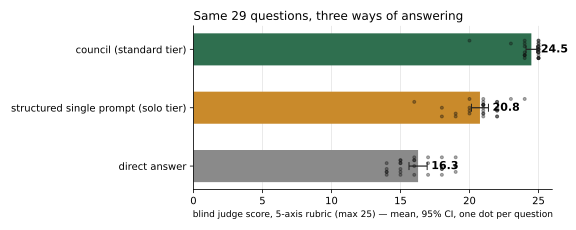
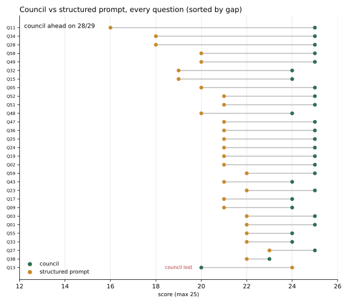

# wise-men

**A council of Claude subagents that argue, grade each other, and hand you a synthesized answer with the dissent preserved.**

[](https://github.com/Ali-expandings/wise-men/stargazers) [](LICENSE) [](https://github.com/Ali-expandings/wise-men/actions/workflows/check.yml) [](#install)

Most prompt patterns ask you to take their word for it. This one ships with the blind eval that tested it — raw answers, judgments, and the script that reproduces the p-value.

```
/plugin marketplace add Ali-expandings/wise-men
/plugin install wise-men@wise-men
```

Then: *"run a council on whether we should rewrite the billing service or strangle it incrementally"*.

---

## Does it actually work?

**Short version: the core loop is measured; the refinements on top are field-used, not measured.** The numbers below come from the **v2.3-era core loop** — a council with no context brief, no reasoning-procedure assignment, no validators, no synthesis-checker, and with the Devil's-Advocate model upgrade deliberately switched off so every member ran the same model. Everything this repo adds on top of that is *reasoned from* the result, not measured by it. The measured configuration is weaker than what ships, so the shipped default should be at least as good — but treat that as an expectation, not a finding. The judge was a single blinded Claude model grading Claude outputs, which is exactly the bias described in one of the papers credited at the bottom of this file.

With that stated plainly, here is what was measured: a 30-question blind evaluation, 3 arms per question, 5-axis rubric (max 25):



| Arm | Mean | Median |
|---|---|---|
| **C — full council** | **24.5** | 25 |
| B — one structured prompt (5 perspectives + dissent, single call) | 20.8 | 21 |
| A — direct answer | 16.3 | 16 |

- The council beat the structured single prompt on **28 of 29** persisted questions.
- Wilcoxon signed-rank: **p = 6.3 × 10⁻⁶** (council > structured prompt), **p = 1.3 × 10⁻⁶** (council > direct).
- No rubric axis was significantly worse; four of five were significantly better.
- It won **13/13** questions labeled single-prompt-shaped (written to favour one structured prompt).

<details>
<summary>Every question, and where the gap comes from</summary>




Charts regenerate from `eval-data/parsed/` with `python3 scripts/make_charts.py`.
</details>

**Read the caveats too** — they're in `eval-data/HISTORY.md` and they're real: one blind judge, Claude judging Claude, N=29 with the 30th question outstanding, a p-value computed one question short of the pre-registered stopping rule (`HISTORY.md` literally says "do not declare a verdict before then"), the measured-vs-shipped gap described above, a treatment change to Arm B mid-eval (an anti-spawn wrapper), a reviewer-prompt fix that was reversed mid-eval, two early judgments salvaged from chat context rather than captured from disk, one question (Q23) resolved by a third blind judge, and two questions (Q09/Q11) whose Chairman model was never recorded — dropping them leaves the result unchanged (N=27, 26/27, p=1.4e-05; `eval-data/analysis/RESULTS_N29.md`).

**Reproducing the numbers.** Requires Python 3 and PyYAML (`pip install pyyaml`), then:

```bash
python3 eval-data/analysis/wilcoxon_n29.py
```

It prints `Loaded 29 questions`, means C=24.48 / B=20.76 / A=16.28, and `C > B ... p=6.30e-06` (last verified 2026-09-16 on the packaged script). **If it doesn't, that's a bug — please open an issue.** The exact v2.3 protocol the eval measured ships verbatim in `eval-data/protocol-v2.3-frozen/`.

The other honest finding: **a single structured prompt (Arm B, 20.8) captures most of the gain for none of the cost.** That's shipped here as `solo` tier and it's the default for easy questions. Spend the full council when the decision is worth ~10 subagent calls.

---

## Field use (Jul–Sep 2026)

Versions 3.0–3.7 of this protocol ran ~35 real councils across ~15 projects — code cutovers, business plans, hiring, brand, security, one go-live audit at paranoid tier. That is use, not measurement, and it validates the *problems* the v3.8 rules fix, not the rules themselves: those were written from the transcripts afterwards, and their first live run was the skill reviewing its own release (2026-09-16, deep tier, record in `CHANGELOG.md`). The synthesis checker (Stage 4.5) rejected the Chairman's first draft in at least four runs for real errors (fabricated attributions, a pre-debate quote presented as post-debate, undisclosed shortcuts). What broke in the field became v3.8: a reviewer floor instead of a rule every run violated, a verbatim grading packet, an anti-anchoring rule for the orchestrator, a post-council verification step, defined round-2 pairing, and a persisted council record. Details in `SKILL.md` → "Field record".

## Install

**Plugin (recommended — one step, the member agent registers itself):**

```
/plugin marketplace add Ali-expandings/wise-men
/plugin install wise-men@wise-men
```

**Or clone into your skills folder:**

```bash
git clone https://github.com/Ali-expandings/wise-men.git ~/.claude/skills/wise-men
mkdir -p ~/.claude/agents && cp ~/.claude/skills/wise-men/agents/wise-member.md ~/.claude/agents/
```

The second line matters for the clone path: `wise-member` is a **tool-restricted agent** (read-only, no ability to spawn agents or run commands) used for every council member. It makes runaway recursion structurally impossible instead of merely asking the model not to. The plugin install registers it automatically (as `wise-men:wise-member`); the clone install needs the copy. Without it the skill still runs — just on a politer guarantee.

Requires [Claude Code](https://claude.com/claude-code). No API keys, no external services, no Python (except to re-run the eval stats). Restart Claude Code, then:

```
/wise-men:wise-men should we rewrite the billing service or strangle it incrementally?
```

(`/wise-men` with the clone install; plain language — "run a council on…", "red team this" — works with both.)

## Usage

```
/wise-men <question>              # auto-picks effort from the question's stakes
/wise-men deep <question>         # 5-7 members + a debate round when they split
/wise-men paranoid <question>     # 7 members, two debate rounds — irreversible calls
/wise-men <question> --solo       # zero subagents, one structured pass
```

Flags: `--full` (whole audit trail), `--brief`, `--debate`, `--model=…`, `--cheap`, `--strong`.

It also answers to plain language — "run a council on this", "red team this plan", "stress-test this idea".

**Don't** use it for lookups, one-liners, or decisions you've already made. It says so itself and will hand you a direct answer instead.

## How it works

```
Pre-flight → difficulty (depth / stakes / novelty, max-dominates) → tier
  Stage 0    pick personas by domain; Devil's Advocate is mandatory
             each member gets a distinct REASONING PROCEDURE
             (precedent · first principles · base rates · incentives · falsification)
  Stage 0.5  one shared, facts-only context brief — members are otherwise blind
  Stage 1    N members answer in parallel, fixed 5-section contract  → validator
  Stage 2    N fresh neutral graders score everyone on a 4-axis rubric → validator
  Stage 3    debate round if the council genuinely splits
  Stage 4    Chairman synthesizes — dissent preserved verbatim
  Stage 4.5  an independent checker audits the synthesis before you see it
```

Two design choices carry most of the weight:

**Diversity comes from reasoning procedures, not job titles.** Ensembles help when errors *decorrelate*. Five personas that all pattern-match the same way just agree with themselves five times, so each member is assigned a different way of reasoning about the problem.

**Dissent is structurally protected.** It's preserved verbatim, it can't be truncated by any brevity flag, and it must be a clean counter-position — re-stating the majority view with hedges doesn't count. The eval's single council loss was exactly that failure.

## How it compares

The question every prompt-skill gets asked — after ponytail's benchmark was matched by a seven-word prompt — is *does the skill beat just asking well?* This eval was built around that question. Arm B is one structured prompt (five perspectives + a dissent, no subagents); it is also shipped as the `solo` tier.

| vs direct answer (blind, 25-pt rubric, N=29) | score | beat the structured prompt | cost |
|---|---|---|---|
| **wise-men council** (standard tier) | **24.5** | **28 / 29** | ~5–7¢ |
| structured single prompt (= `solo` tier) | 20.8 | — | ~free |
| direct answer | 16.3 | 0 / 29 | ~free |

Against the other council skills for Claude Code (facts from their READMEs, 2026-09-16; full table with sources in [`resources/landscape.md`](resources/landscape.md)):

| | wise-men | [llm-council skill](https://github.com/aiwithremy/claude-skills-llm-council) 2.1k★ | [llm-council-skill](https://github.com/tenfoldmarc/llm-council-skill) 766★ | [council-review](https://github.com/ngmeyer/council-review) | [agent-review-panel](https://github.com/wan-huiyan/agent-review-panel) |
|---|---|---|---|---|---|
| Independent members, no keys | yes | yes | yes | yes | yes |
| Peer review | 4-axis rubric, parsed + validated | method unspecified | anonymized | anonymous, confidence | blind final score |
| Debate | conditional, mechanical trigger | — | inside review | adaptive multi-round | 1–3 rounds |
| Dissent preserved | verbatim, cannot be truncated | agree/clash | agree/clash | "What You Lose" | with judge rulings |
| Independent check of the synthesis | yes | — | — | — | Opus judge |
| Members structurally unable to spawn/run/write | yes | — | — | — | read-only shell |
| Cost tiers | 5, with spend ceiling | — | — | 5 modes | budget mode |
| Evidence in the repo | raw eval + script | none | none | one A/B figure | one cost audit |


What they have that this doesn't: multi-vendor councils, convergence-driven long debates, consensus gates, code-specific scanners, HTML reports — listed honestly in the landscape file.

## Cost

Roughly: solo ~free, quick ~3-5¢, standard ~5-7¢, deep ~15¢, paranoid ~25-50¢ per question (2026-07 pricing, cheap models on routine roles). Cheap models grade; stronger models argue; the model mapping lives in one table in `resources/model-routing.md` — update it there when models change and nothing else moves.

## Limits (the ones that matter)

- **Single-model.** Every member is Claude, so persona diversity approximates but doesn't achieve architectural diversity. Shared blindspots survive.
- **The Chairman is the orchestrator.** Same thread picks the personas and writes the synthesis. Stage 4.5's external checker mitigates this; it doesn't remove it.
- **The refinements aren't separately measured.** The eval validated the core loop. Everything added since is reasoned from it and shaped by live use — which is the same circularity the skill would flag in your reasoning. A held-out second eval is the open item.
- **Members are offline.** `wise-member` cannot browse or run anything. Facts go in through the context brief; flagged claims are verified by the orchestrator afterwards, in a separately labeled section.
- **Verbose.** `SKILL.md` is long. A casual invocation reads it, improvises, and mostly gets the protocol right; the numbered runbook at the top exists to keep that honest.

## Repo layout

```
.claude-plugin/           plugin + marketplace manifests
SKILL.md                  the protocol (the only file auto-loaded)
agents/wise-member.md     tool-restricted member agent — auto-registered by the plugin install
resources/                personas · model routing · stage prompt templates · council-record template · landscape (competitors, sourced)
examples/                 two worked end-to-end runs
eval-spec.md              the frozen evaluation design (written before the eval ran)
eval-data/                the full blind eval: questions, raw arms, judgments, stats, frozen v2.3 protocol
scripts/check.sh          consistency check — run before every commit (trigger sync, no $-digit, agent copy, PII)
scripts/make_charts.py    regenerates assets/*.svg from eval-data/parsed/
assets/                   the README charts (SVG + PNG)
CHANGELOG.md              condensed version history (detail in eval-data/SESSION_LOG.md)
requirements.txt          PyYAML — only needed to re-run the eval stats
AGENTS.md · CONTRIBUTING.md · SECURITY.md · LICENSE · .gitignore
```

The skill itself has **no runtime dependencies** — it is markdown that Claude Code reads. Python and PyYAML are needed only if you want to recompute the eval statistics yourself.

## Credits

Inspired by [karpathy/llm-council](https://github.com/karpathy/llm-council). Design choices drew on — but are **not validated by** — Du et al. 2023 (multi-agent debate), Liang et al. 2024 (divergent thinking), Khan et al. 2024 (debate via persuasion), Zheng et al. 2024 (LLM-as-judge bias).

Built and audited in Claude Code, including by running the council on itself.

## License

MIT — see [LICENSE](LICENSE).
